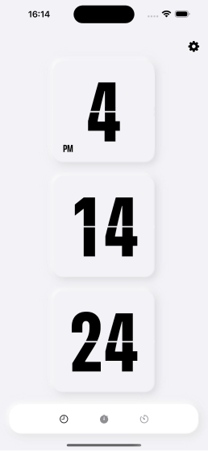
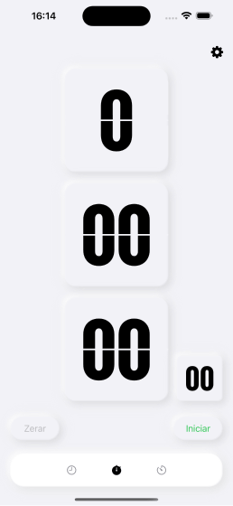

# NeoFlip Clock

NeoFlip Clock is an alternative approach to the classic clock app with neumorphism design and simplicity. It's features are a clock, stopwatch and a timer. It has been developed using SwiftUI with aim of testing out new technologies and publishing an app for the first time in the App Store. Other tools I have used are: UIkit for an hour/minute/seconds picker, [SwiftLint](https://github.com/realm/SwiftLint) and [SwiftGen](https://github.com/SwiftGen/SwiftGen).

Link to the appstore: [https://apps.apple.com/br/app/neoflip-clock/id6459699583](https://apps.apple.com/br/app/neoflip-clock/id6459699583)

